# Routine

Este projeto consiste em um aplicativo com o propósito de auxiliar na rotina com:
- Controle financeiro
- Controle de tarefas diárias
- Controle de refeições
- Controle de treinos
- IA pessoal

## Documentação

[Documentação](https://drive.google.com/drive/folders/1ZAmGGtibudneU68qirLa-FDqOuBvKO9z?usp=drive_link)

## Conteúdo
- [Funcionalidades](#funcionalidades)
- [Tecnologias e integrações](#tecnologias-e-integrações)
- [Configuração do Backend](#configuração-do-backend)
    - [Documentação do Backend](#documentação-do-backend)
    - [Variáveis de Ambiente do Backend](#variáveis-de-ambiente-do-backend)
    - [Execução do Backend](#execução-do-backend)
- [Configuração do Frontend](#configuração-do-frontend)
    - [Variáveis de Ambiente do Frontend](#variáveis-de-ambiente-do-frontend)
    - [Execução do Frontend](#execução-do-frontend)
- [Licença](#licença)

## Funcionalidades
<video controls src="imgs/example_use.mp4" title="Title"></video>+

### Início
<div style="display: flex; gap: 10px;">
  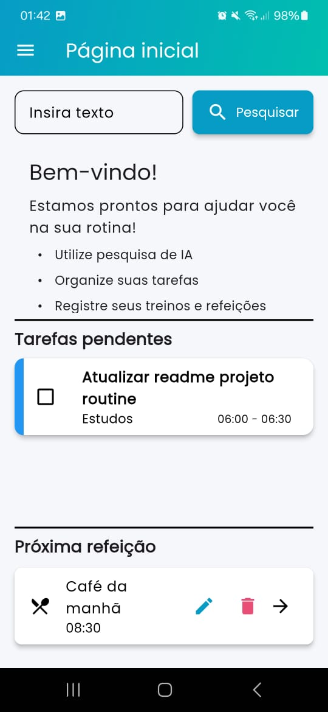
  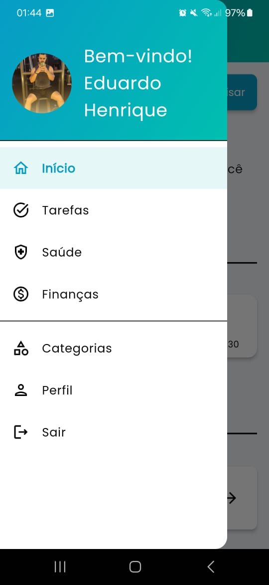
</div>

### Tarefas
<div style="display: flex; gap: 10px;">
  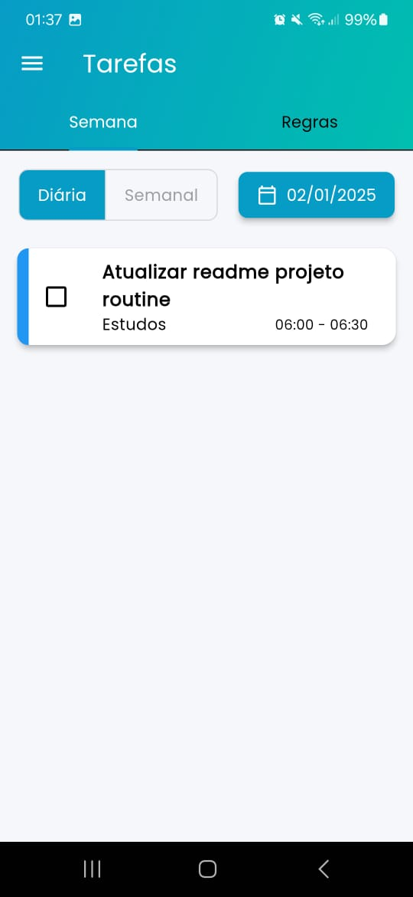
  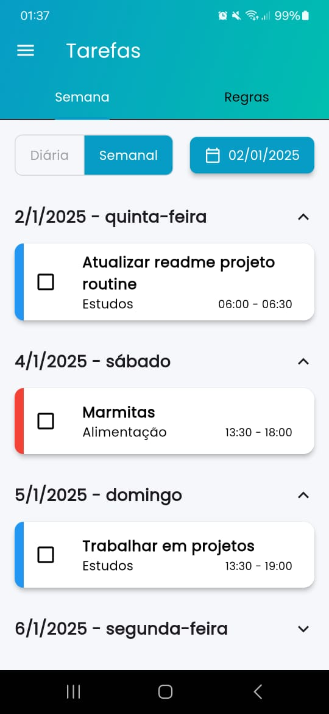
</div>

### Refeições
<div style="display: flex; gap: 10px;">
  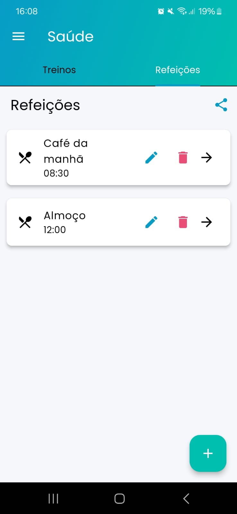
  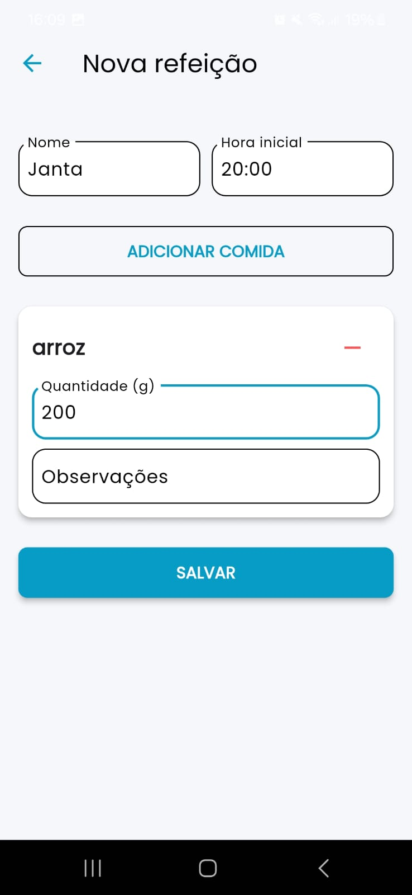
</div>
<div style="display: flex;  gap: 10px; margin-top: 10px;">
  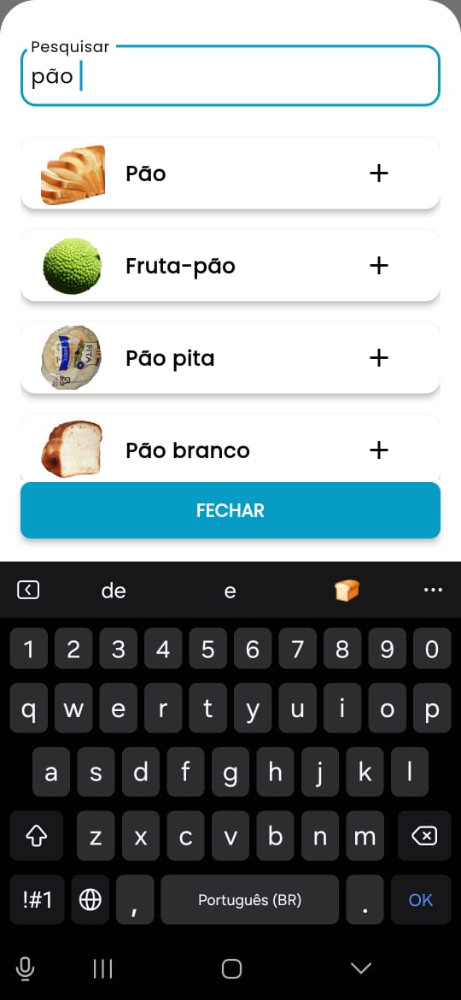
  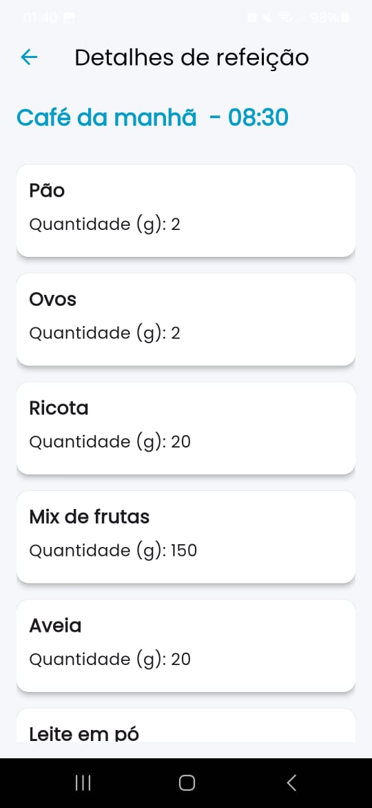ø
</div>

### Treinos
<div style="display: flex; gap: 10px;">
  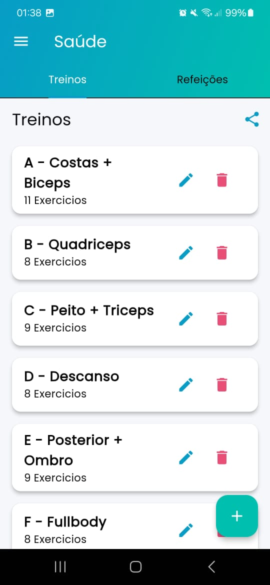
  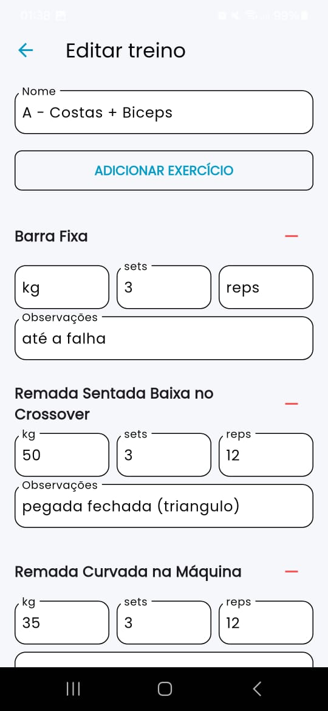
</div>
<div style="display: flex;  gap: 10px; margin-top: 10px;">
  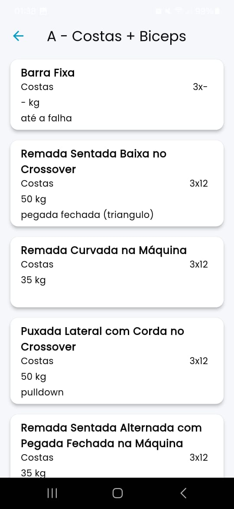ø
</div>

### Finanças
<div style="display: flex; gap: 10px;">
  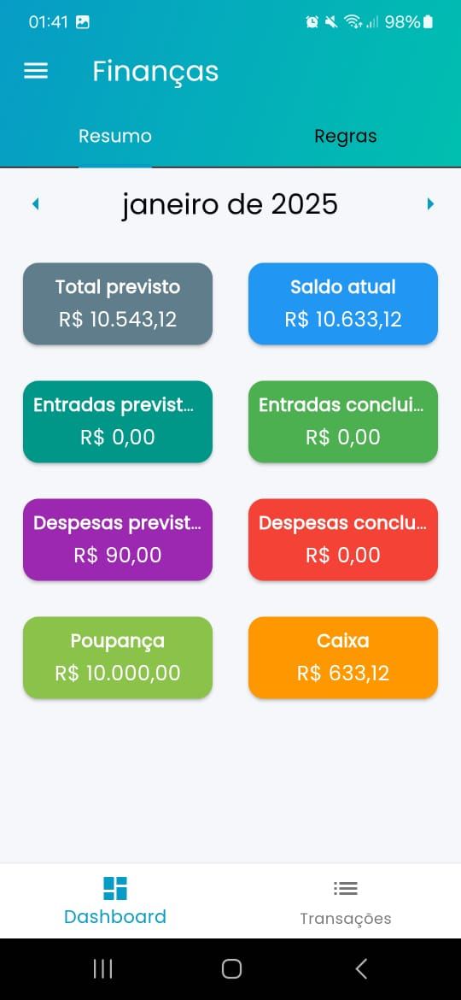
  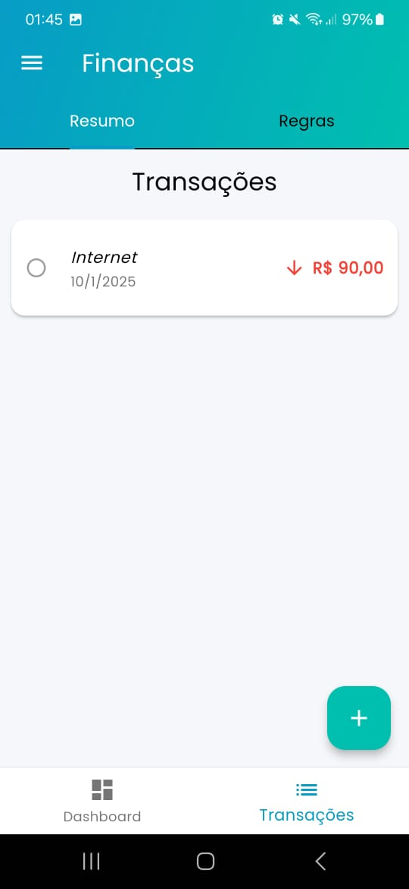
</div>

## Tecnologias e integrações

### Tecnologias
- [Go](https://golang.org/dl/) (1.19 ou superior)
- [Flutter](https://flutter.dev/docs/get-started/install) (2.x ou superior)
- PostgreSQL - para o banco de dados local
- [Make](https://www.gnu.org/software/make/)
- [Supabase](https://supabase.com/) - para o banco de dados de produção

### Integrações
- **GPT**  
  * Link: [Console GPT](https://console.groq.com/docs/overview)  
  * Uso: Pesquisa para o usuário na página inicial.

- **Foods**  
  * Link: [Nutritionix API](https://trackapi.nutritionix.com/)  
  * Uso: Busca de alimentos para a dieta do usuário.

## Configuração do Backend

### Documentação do Backend

[Documentação](https://routine-back.onrender.com/api/v1/swagger/index.html)

### Variáveis de Ambiente do Backend

Crie um arquivo `.env` no diretório raiz do backend com a seguinte estrutura:

```bash
ENV=dev
PORT=3007

DB_HOST_PROD=
DB_USER_PROD=
DB_PASSWORD_PROD=
DB_NAME_PROD=
DB_PORT_PROD=
DB_SCHEMA_PROD=

DB_HOST=localhost
DB_USER=postgres
DB_PASSWORD=****
DB_NAME=routine
DB_PORT=5432

FOOD_API_HOST=
FOOD_API_KEY=
FOOD_APP_ID=
GPT_API_KEY=
GPT_API_URL=

EXERCISES_API_HOST=
EXERCISES_API_KEY=
```

### Execução do Backend

```bash
go mod tidy
make
```

## Configuração do Frontend

### Variáveis de Ambiente do Frontend

Crie um arquivo .env no diretório raiz do frontend com a seguinte estrutura:

```bash
URL_API=yourUrlApi
```

### Execução do Frontend

```bash
flutter pub get
flutter run
```

### Licença

Este projeto está licenciado sob a Licença MIT.

